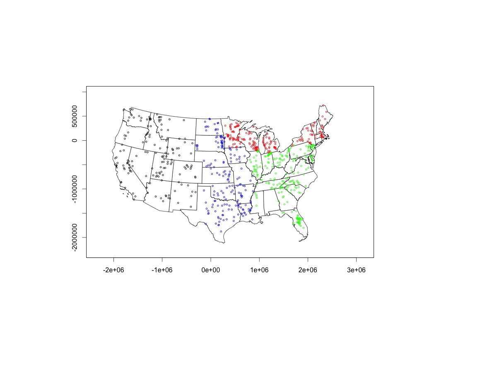

# National Eutrophication Survey

This respository contains a digitally transcribed copy of the National Eutrophication Survey (NES) dataset. The original data can be found in the `archival_pdfs` folder or by searching: https://www.epa.gov/nscep

## References

Stachelek, J., Ford, C., Kincaid, D., King, K., Miller, H., Nagelkirk, R. (_in prep_) The National Eutrophication Survey: lake characteristics and historical nutrient concentrations. 

Stachelek, J. (2017). nesR: Scrape Data from National Eutrophication Survey archival PDFs. R package version 0.1. (https://github.com/jsta/nesR) (https://dx.doi.org/10.5281/zenodo.400258)
