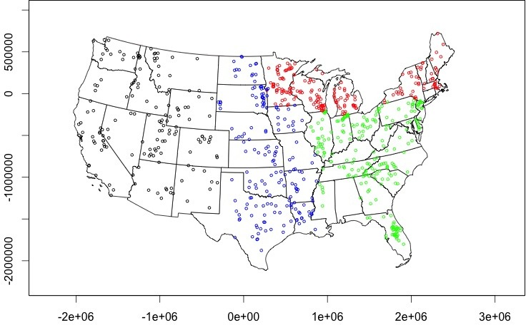

<!-- README.md is generated from README.Rmd. Please edit that file -->
National Eutrophication Survey
==============================

This respository contains a digitally transcribed copy ([nes\_data.csv](https://github.com/ReproducibleQM/NES/blob/master/nes_data.csv)) of the National Eutrophication Survey (NES) dataset. The original data can be found in the `archival_pdfs` folder or by searching: <https://www.epa.gov/nscep>

Locations
---------

Data
----

<!-- Do not edit this table without first updating METADATA.md -->
<table style="width:68%;">
<colgroup>
<col width="22%" />
<col width="37%" />
<col width="8%" />
</colgroup>
<thead>
<tr class="header">
<th>variable name</th>
<th>description</th>
<th>units</th>
</tr>
</thead>
<tbody>
<tr class="odd">
<td>pdf</td>
<td>pdf identifier (474 - 477)</td>
<td>integer</td>
</tr>
<tr class="even">
<td>pagenum</td>
<td>page number of the pdf</td>
<td>integer</td>
</tr>
<tr class="odd">
<td>storet_code</td>
<td>identifier which links measurement to coordinate locations</td>
<td>character</td>
</tr>
<tr class="even">
<td>state</td>
<td>state where the water body resides</td>
<td>character</td>
</tr>
<tr class="odd">
<td>name</td>
<td>name of the water body</td>
<td>character</td>
</tr>
<tr class="even">
<td>county</td>
<td>county where the water body resides</td>
<td>character</td>
</tr>
<tr class="odd">
<td>lake_type</td>
<td>natural or impoundment</td>
<td>character</td>
</tr>
<tr class="even">
<td>drainage_area</td>
<td>the total drainage area</td>
<td>square kilometers</td>
</tr>
<tr class="odd">
<td>surface_area</td>
<td>the area of the water surface</td>
<td>sq km</td>
</tr>
<tr class="even">
<td>mean_depth</td>
<td>the volume of the water body divided by the surface area in square meters</td>
<td>cubic meters</td>
</tr>
<tr class="odd">
<td>total_inflow</td>
<td>the mean of the inflows of all tributaries and the immediate drainage</td>
<td>cubic meters per second</td>
</tr>
<tr class="even">
<td>retention_time</td>
<td>a mean value determined by dividing the lake volume, in cubic meters, by the mean annual outflow in cubic meters per unit cof time</td>
<td>years or days</td>
</tr>
<tr class="odd">
<td>retention_time_units</td>
<td>the units of time for each retention entry</td>
<td>years or days</td>
</tr>
<tr class="even">
<td>alkalinity</td>
<td>alkalinity</td>
<td>milligrams per liter</td>
</tr>
<tr class="odd">
<td>conductivity</td>
<td>conductivity</td>
<td>microohms</td>
</tr>
<tr class="even">
<td>secchi</td>
<td>secchi</td>
<td>meters</td>
</tr>
<tr class="odd">
<td>tp</td>
<td>total phosphorus</td>
<td>milligrams per liter</td>
</tr>
<tr class="even">
<td>po4</td>
<td>orthophosphate</td>
<td>milligrams per liter</td>
</tr>
<tr class="odd">
<td>tin</td>
<td>total inorganic nitrogen</td>
<td>milligrams per liter</td>
</tr>
<tr class="even">
<td>tn</td>
<td>total nitrogen</td>
<td>milligrams per liter</td>
</tr>
<tr class="odd">
<td>p_pnt_source_muni</td>
<td>municipal point source phosphorus loading</td>
<td>kilograms per year</td>
</tr>
<tr class="even">
<td>p_pnt_source_industrial</td>
<td>industrial point source phosphorus loading</td>
<td>kilograms per year</td>
</tr>
<tr class="odd">
<td>p_pnt_source_septic</td>
<td>septic point source phosphorus loading</td>
<td>kilograms per year</td>
</tr>
<tr class="even">
<td>p_nonpnt_source</td>
<td>nonpoint source phosphorus loading</td>
<td>kilograms per year</td>
</tr>
<tr class="odd">
<td>p_total</td>
<td>total phosphorus loading</td>
<td>kilograms per year</td>
</tr>
<tr class="even">
<td>n_pnt_source_muni</td>
<td>municipal point source nitrogen loading</td>
<td>kilograms per year</td>
</tr>
<tr class="odd">
<td>n_pnt_source_industrial</td>
<td>industrial point source nitrogen loading</td>
<td>kilograms per year</td>
</tr>
<tr class="even">
<td>n_pnt_source_septic</td>
<td>septic point source nitrogen loading</td>
<td>kilograms per year</td>
</tr>
<tr class="odd">
<td>n_nonpnt_source</td>
<td>nonpoint source nitrogen loading</td>
<td>kilograms per year</td>
</tr>
<tr class="even">
<td>n_total</td>
<td>total nitrogen loading</td>
<td>kilograms per year</td>
</tr>
<tr class="odd">
<td>p_total_out</td>
<td>total phosphorus outlet load</td>
<td>kilograms per year</td>
</tr>
<tr class="even">
<td>p_percent_retention</td>
<td>percent phosphorus retention</td>
<td>percent</td>
</tr>
<tr class="odd">
<td>p_surface_area_loading</td>
<td>phosphorus surface area loading</td>
<td>grams per square meter per year</td>
</tr>
<tr class="even">
<td>n_total_out</td>
<td>total nitrogen outlet load</td>
<td>kilograms per year</td>
</tr>
<tr class="odd">
<td>n_percent_retention</td>
<td>percent nitrogen retention</td>
<td>percent</td>
</tr>
<tr class="even">
<td>n_surface_area_loading</td>
<td>nitrogen surface area loading</td>
<td>grams per square meter per year</td>
</tr>
<tr class="odd">
<td>lat</td>
<td>latitude</td>
<td>decimal degrees</td>
</tr>
<tr class="even">
<td>long</td>
<td>longitude</td>
<td>decimal degrees</td>
</tr>
</tbody>
</table>

References
----------

Stachelek, J., Ford, C., Kincaid, D., King, K., Miller, H., Nagelkirk, R. (*in prep*) The National Eutrophication Survey: lake characteristics and historical nutrient concentrations.

Stachelek, J. (2017). nesR: Scrape Data from National Eutrophication Survey archival PDFs. R package version 0.1. (<https://github.com/jsta/nesR>) (<https://dx.doi.org/10.5281/zenodo.400258>)
